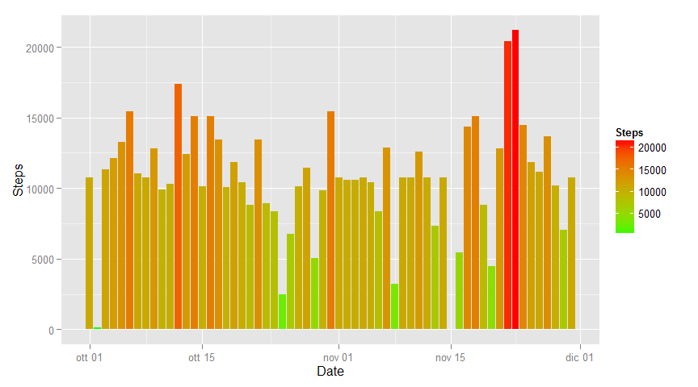
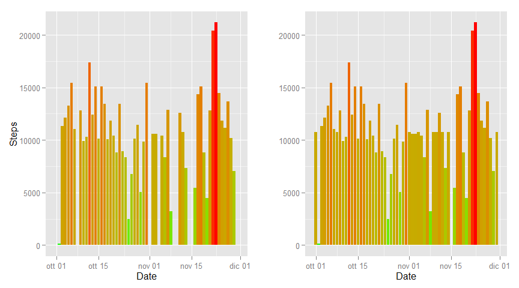

# Reproducible Research: Peer Assessment 1


```r
require(dplyr)
require(ggplot2)
require(grid)
require(gridExtra)
require(chron)
```

## Loading and preprocessing the data


```r
rawData <- read.csv('activity.csv', header=TRUE)
summary(rawData)
```

```
##      steps                date          interval     
##  Min.   :  0.00   2012-10-01:  288   Min.   :   0.0  
##  1st Qu.:  0.00   2012-10-02:  288   1st Qu.: 588.8  
##  Median :  0.00   2012-10-03:  288   Median :1177.5  
##  Mean   : 37.38   2012-10-04:  288   Mean   :1177.5  
##  3rd Qu.: 12.00   2012-10-05:  288   3rd Qu.:1766.2  
##  Max.   :806.00   2012-10-06:  288   Max.   :2355.0  
##  NA's   :2304     (Other)   :15840
```

## What is mean total number of steps taken per day?


```r
rawData <- rawData %>%
        mutate(parsedDate = as.Date(date, "%Y-%m-%d"))

dayData <- rawData %>%
        group_by(parsedDate) %>%
                summarise(daySum = sum(steps, na.rm=TRUE))
```


```r
p1 <- ggplot(dayData) +
        geom_histogram(aes(x=parsedDate, y=daySum, fill=daySum), stat="identity") +
        scale_fill_gradient("Steps", low = "green", high = "red") +
        labs(x="Date", y="Steps")

print(p1)
```

 

The value of the mean per day is calculated with this statement:


```r
meanValue <- mean(dayData$daySum) 
```

and the values is 9354.2295082 (Steps / Day) 

For the median value is used:


```r
medianValue <- median(dayData$daySum)
```

and the value is 10395 (Steps / Day) 

## What is the average daily activity pattern?


```r
avgPattern <- rawData %>%
        group_by(interval) %>%
        summarise(avgStep = mean(steps, na.rm=TRUE))

ggplot(avgPattern, aes(interval, avgStep)) +
        geom_line(colour = "red", size = 1) +
        labs(x="Interval", y="AVG of Steps")
```

 


```r
intervalMax <- avgPattern[which.max(avgPattern$avgStep),]$interval
maxSteps <- avgPattern[avgPattern == intervalMax,]$avgStep
```

At interval 835 we have the maximum value> 206.1698113

## Imputing missing values

total number of 'NA' values is 2304


```r
replaceNaData <- rawData %>%
        group_by(parsedDate) %>%
                transform(steps = 
                        ifelse(is.na(steps), 
                                mean(steps, na.rm=TRUE), 
                                steps))

dayDataWithNoNa <- replaceNaData %>%
        group_by(parsedDate) %>%
                summarise(daySumWithNoNa = sum(steps, na.rm=TRUE))
                 
p2 <- ggplot(dayDataWithNoNa) +
        geom_histogram(
                aes(x=parsedDate, 
                    y=daySumWithNoNa, 
                    fill=daySumWithNoNa),
                stat="identity") +
        scale_fill_gradient("Steps", low = "green", high = "red") +
        labs(x="Date", y="Steps")

print(p2)
```

 

The value of the mean per day int the dataset without NAs is calculated with this statement:


```r
meanValue2 <- mean(dayDataWithNoNa$daySumWithNoNa) 
```

and the values is 1.0766189\times 10^{4} (Steps / Day) 

For the median value is used:


```r
medianValue2 <- median(dayDataWithNoNa$daySumWithNoNa)
```

and the value is 1.0766189\times 10^{4} (Steps / Day) 

###Now a comparision between rawData and 'NA' replaced Data.


```r
p1 <- p1 +
        theme(legend.position="none") 

p2 <- p2 +
        theme(legend.position="none") +
        ylab("")

grid.arrange(p1, p2, nrow=1, ncol=2)
```

 

## Are there differences in activity patterns between weekdays and weekends?


```r
replaceNaData <- replaceNaData %>% 
        mutate(dayType=as.factor(
                ifelse(
                        is.weekend(
                                rawData$parsedDate), 
                        "WEEKEND", 
                        "WEEKDAY" )))


weekDayAndWeekend <- replaceNaData %>%
        group_by(interval, dayType) %>%
        summarise(weekSteps=sum(steps))

ggplot(weekDayAndWeekend, aes(x=interval, y=weekSteps)) +
        geom_line() +
        facet_grid(dayType~.,scales="free_x") +
        labs(x="Interval", y="Steps")
```

 
