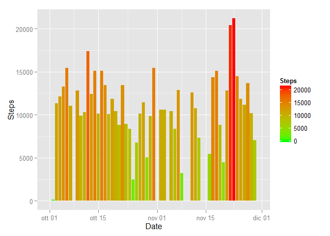

# Reproducible Research: Peer Assessment 1


## Loading and preprocessing the data


```r
rawData <- read.csv('activity.csv', header=TRUE)
summary(rawData)
```

```
##      steps                date          interval     
##  Min.   :  0.00   2012-10-01:  288   Min.   :   0.0  
##  1st Qu.:  0.00   2012-10-02:  288   1st Qu.: 588.8  
##  Median :  0.00   2012-10-03:  288   Median :1177.5  
##  Mean   : 37.38   2012-10-04:  288   Mean   :1177.5  
##  3rd Qu.: 12.00   2012-10-05:  288   3rd Qu.:1766.2  
##  Max.   :806.00   2012-10-06:  288   Max.   :2355.0  
##  NA's   :2304     (Other)   :15840
```

## What is mean total number of steps taken per day?


```r
library(dplyr)
library(ggplot2)

rawData <- rawData %>%
        mutate(parsedDate = as.Date(date, "%Y-%m-%d"))

dayData <- rawData %>%
        group_by(parsedDate) %>%
                summarise(daySum = sum(steps, na.rm=TRUE))
                 
ggplot(dayData) +
        geom_histogram(aes(x=parsedDate, y=daySum, fill=daySum), stat="identity") +
        scale_fill_gradient("Steps", low = "green", high = "red") +
        labs(x="Date", y="Steps")
```

 

The value of the mean per day is calculated with this statement:


```r
meanValue <- mean(dayData$daySum) 
```

and the values is 9354.2295082 (Steps / Day) 

For the median value is used:


```r
medianValue <- median(dayData$daySum)
```

and the value is 10395 (Steps / Day) 

## What is the average daily activity pattern?


## Imputing missing values


## Are there differences in activity patterns between weekdays and weekends?
