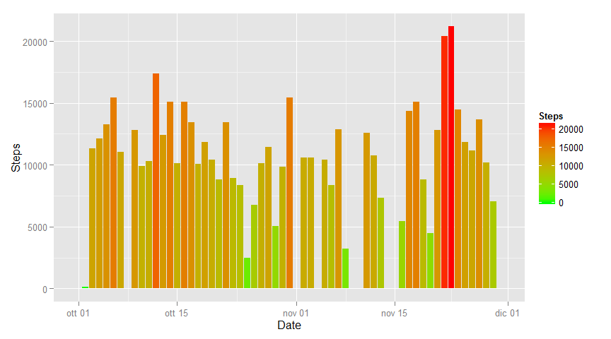
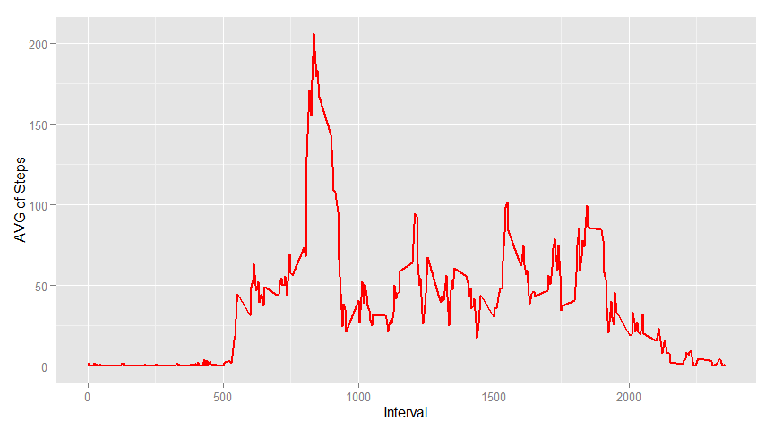
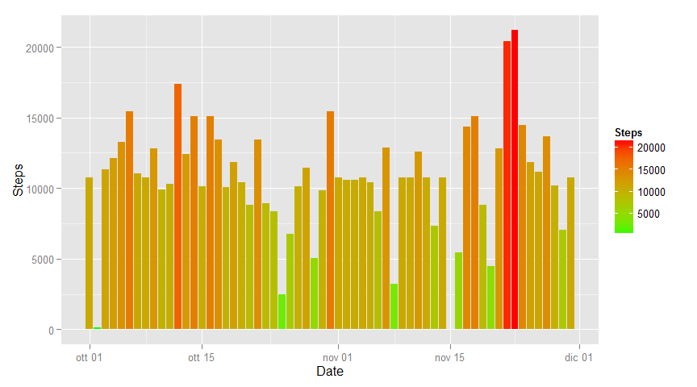
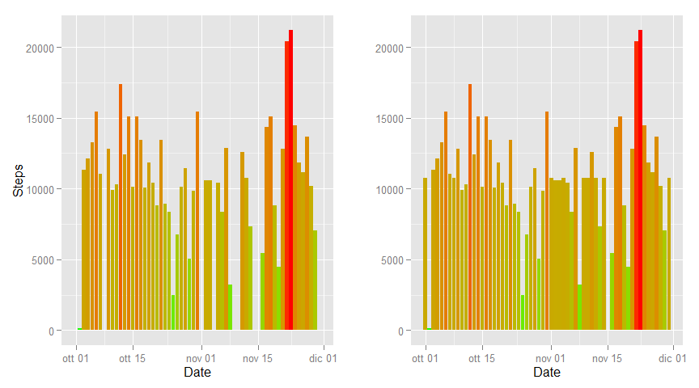
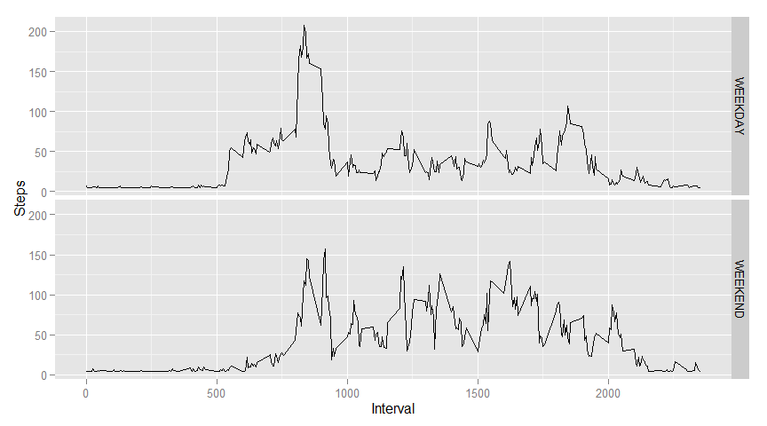

# Reproducible Research: Peer Assessment 1

these are the R libreary used in this analysis:


```r
require(dplyr)
require(ggplot2)
require(grid)
require(gridExtra)
require(chron)
```

## Loading and preprocessing the data

All the observations are loaded from the Comma separated file "activity.csv" 
This is the R code used to load the data, after a summary of the Data Frame loaded.


```r
rawData <- read.csv('activity.csv', header=TRUE)
summary(rawData)
```

```
##      steps                date          interval     
##  Min.   :  0.00   2012-10-01:  288   Min.   :   0.0  
##  1st Qu.:  0.00   2012-10-02:  288   1st Qu.: 588.8  
##  Median :  0.00   2012-10-03:  288   Median :1177.5  
##  Mean   : 37.38   2012-10-04:  288   Mean   :1177.5  
##  3rd Qu.: 12.00   2012-10-05:  288   3rd Qu.:1766.2  
##  Max.   :806.00   2012-10-06:  288   Max.   :2355.0  
##  NA's   :2304     (Other)   :15840
```

## What is mean total number of steps taken per day?
    
The first step to answer the question is to adapt this data for the analysis, is to create a column fo Date type for gouping datas; after data are grouped by day and the steps are summarised excluding NAs.


```r
rawData <- rawData %>%
        mutate(parsedDate = as.Date(date, "%Y-%m-%d"))

dayData <- rawData %>%
        group_by(parsedDate) %>%
                summarise(daySum = sum(steps, na.rm=TRUE))
```

This plot represent the sum of steps group by day, the number of steps is olso 
coloured with a gradient to enphasize higher values.


```r
p1 <- ggplot(dayData) +
        geom_histogram(aes(x=parsedDate, y=daySum, fill=daySum), stat="identity") +
        scale_fill_gradient("Steps", low = "green", high = "red") +
        labs(x="Date", y="Steps")

print(p1)
```

 

The value of the mean per day is calculated with this statement:


```r
meanValue <- mean(dayData$daySum) 
```

and the values is 9354.2295082 (Steps / Day) 

For the median value is used:


```r
medianValue <- median(dayData$daySum)
```

and the value is 10395 (Steps / Day) 

## What is the average daily activity pattern?


```r
avgPattern <- rawData %>%
        group_by(interval) %>%
        summarise(avgStep = mean(steps, na.rm=TRUE))

ggplot(avgPattern, aes(interval, avgStep)) +
        geom_line(colour = "red", size = 1) +
        labs(x="Interval", y="AVG of Steps")
```

 


```r
intervalMax <- avgPattern[which.max(avgPattern$avgStep),]$interval
maxSteps <- avgPattern[avgPattern == intervalMax,]$avgStep
```

For the  interval of 835 minute we have the maximum value: 206.1698113 Steps

## Imputing missing values

The total number of 'NA' values is 2304, for replacing NAs values with a reasonable value, i use the mean of the steps per day. replaceNaData contains the data without NAs.


```r
replaceNaData <- rawData %>%
        group_by(parsedDate) %>%
                transform(steps = 
                        ifelse(is.na(steps), 
                                mean(steps, na.rm=TRUE), 
                                steps))

dayDataWithNoNa <- replaceNaData %>%
        group_by(parsedDate) %>%
                summarise(daySumWithNoNa = sum(steps, na.rm=TRUE))
```

As with the graph of the data with the NAs values this graph is coloured with a gradient of color to enphasize the number of steps.


```r
p2 <- ggplot(dayDataWithNoNa) +
        geom_histogram(
                aes(x=parsedDate, 
                    y=daySumWithNoNa, 
                    fill=daySumWithNoNa),
                stat="identity") +
        scale_fill_gradient("Steps", low = "green", high = "red") +
        labs(x="Date", y="Steps")

print(p2)
```

 

The value of the mean per day int the dataset without NAs is calculated with this statement:


```r
meanValue2 <- mean(dayDataWithNoNa$daySumWithNoNa) 
```

and the values is 1.0766189\times 10^{4} (Steps / Day) 

For the median value is used:


```r
medianValue2 <- median(dayDataWithNoNa$daySumWithNoNa)
```

and the value is 1.0766189\times 10^{4} (Steps / Day) 

###Comparision between rawData and 'NA' replaced Data.

For help the understanding of the differenze between the Data Frame with the NAs values and the NAs replaced wit the meand per day of the values, in the next plot, i place side by side the precending graph. 


```r
p1 <- p1 +
        theme(legend.position="none") 

p2 <- p2 +
        theme(legend.position="none") +
        ylab("")

grid.arrange(p1, p2, nrow=1, ncol=2)
```

 

## Are there differences in activity patterns between weekdays and weekends?

I create a factor column in the data frame to distinguish week day from weekend day after, with ggplot i produce two line graphs for the comparison.
The difference from week dasys steps and week end days steps is that the week days are condensed in the morning due to the works activity. The steps in the week end are distribuited in a uniform manner.


```r
replaceNaData <- replaceNaData %>% 
        mutate(dayType=as.factor(
                ifelse(
                        is.weekend(
                                rawData$parsedDate), 
                        "WEEKEND", 
                        "WEEKDAY" )))


weekDayAndWeekend <- replaceNaData %>%
        group_by(interval, dayType) %>%
        summarise(weekSteps=mean(steps))

ggplot(weekDayAndWeekend, aes(x=interval, y=weekSteps)) +
        geom_line() +
        facet_grid(dayType~.,scales="free_x") +
        labs(x="Interval", y="Steps")
```

 
